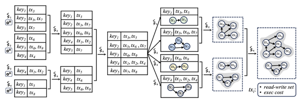

# HyPer：混合负载区块链交易并行执行引擎深度解析

## 概述

HyPer 是一个面向区块链场景的混合负载并行交易执行引擎。本文将深入剖析其流水线架构的设计思想与实现细节，重点阐述并行归并过程中的线程协调机制。

---

## 第一部分：整体架构与设计理念

### 1.1 问题背景

区块链交易执行面临一个核心矛盾：**交易必须按共识顺序提交，但串行执行效率低下**。HyPer 的解决思路是：

1. **乐观并行执行**：多线程同时执行交易，各自记录读写集
2. **事后冲突检测**：通过构建冲突 DAG 发现依赖关系
3. **最大化提交**：从 DAG 中选择最大无冲突子集提交

### 1.2 线程池设计

HyPer 采用**固定大小的线程池**而非按需创建协程，这是一个关键的架构决策。

**从调度角度分析线程池的优势**

虽然 Go 的 goroutine 创建非常轻量（仅需约 2KB 栈空间，创建开销在纳秒级别），但 HyPer 仍然选择固定线程池，核心原因在于**调度控制**：

1. **避免 Go 调度器的不确定性**

   Go 运行时的调度器（GMP 模型）会自动管理 goroutine 到 OS 线程的映射，这种自动调度在通用场景下很方便，但会引入不确定性：

    - goroutine 可能被调度到任意的 P（处理器）上执行
    - 执行过程中可能被抢占并迁移到其他 OS 线程
    - 调度时机不可预测

   对于 HyPer 这种需要精确协调的并发系统，这种不确定性会导致：
    - 配对归并时线程配对的时序难以控制
    - 条件变量的等待/唤醒可能出现意外的延迟
    - 性能波动较大

2. **OS 线程绑定实现调度可控**

   通过 `runtime.LockOSThread()` 将 goroutine 绑定到固定的 OS 线程：

   ```(go)
   func (pe *PipelineEngine) workerThread(workerID int) {
       runtime.LockOSThread()
       defer runtime.UnlockOSThread()
       // ...  工作循环 ...
   }
   ```

   绑定后的效果：
    - **绕过 Go 调度器**：该 goroutine 独占一个 OS 线程，不再参与 Go 的协程调度
    - **由 OS 调度器直接管理**：线程的调度由操作系统内核负责，行为更可预测
    - **减少调度层级**：从 "Go调度器 → OS调度器 → CPU" 简化为 "OS调度器 → CPU"

3. **CPU 亲和性与缓存优化**

   固定的 OS 线程更容易保持 CPU 亲和性：

   ```
   不绑定时：
   goroutine → P0(CPU0) → P2(CPU2) → P1(CPU1) → ...
               ↓ L1/L2缓存失效  ↓ 缓存失效  ↓ 缓存失效

   绑定后：
   goroutine → OS Thread → CPU0 → CPU0 → CPU0 → ...
                           ↓ 缓存命中  ↓ 缓存命中
   ```

   在高性能计算场景下，缓存命中率对性能影响显著：
    - L1 缓存访问：约 1ns
    - L2 缓存访问：约 4ns
    - 主存访问：约 100ns

4. **便于线程间协调**

   固定线程池使得同步协调更加简单可控：

    - **可预知的线程数量**：状态表归并时，可以预计算总合并次数
    - **稳定的线程标识**：每个线程有固定的 workerID，便于配对和状态追踪
    - **确定性的资源分配**：每个线程拥有独立的 EVM 实例，无需动态分配

5. **资源隔离与预分配**

   每个工作线程在初始化时就分配好所需资源：

   ```(go)
   levms := make([]*lvm. LEVM, numThreads)
   for i := 0; i < numThreads; i++ {
       levms[i] = levm.Copy()  // 每个线程独立的 EVM
   }
   ```

   好处：
    - 避免运行时的资源竞争
    - 消除动态内存分配的开销
    - EVM 状态完全隔离，无需加锁

**线程池初始化**：

```(go)
func NewPipelineEngine(levm *lvm.LEVM, numThreads int) *PipelineEngine {
    levms := make([]*lvm. LEVM, numThreads)
    for i := 0; i < numThreads; i++ {
        levms[i] = levm.Copy()
    }
    
    pl := &PipelineEngine{
        levms:         levms,
        numThreads:    numThreads,
        workerStaties: make([]*WorkerStats, numThreads),
        stopChan:      make(chan struct{}),
        completeChan:  make(chan int, 100),
    }
    return pl
}
```

**总结：线程池 vs 按需创建 goroutine**

| 维度           | 固定线程池 + OS绑定              | 按需创建 goroutine         |
|----------------|----------------------------------|----------------------------|
| 调度控制       | OS 直接调度，可预测              | Go 调度器管理，不确定      |
| CPU 亲和性     | 容易保持，缓存友好               | 可能迁移，缓存不友好       |
| 线程间协调     | 线程数固定，易于同步             | 数量动态，协调复杂         |
| 资源管理       | 预分配，无竞争                   | 动态分配，可能竞争         |
| 适用场景       | 计算密集、需要精确协调           | I/O 密集、任务独立         |

### 1.3 核心数据流

整个执行过程可以抽象为以下数据流转：

```
原始交易序列
      │
      ▼
┌──────────────────────────────────────────────────────────────┐
│  阶段一：并行执行                                            │
│  输入：交易列表                                              │
│  输出：每个线程产生一组 ReadWriteSet                         │
│  特点：线程之间完全独立，无需同步                            │
└──────────────────────────────────────────────────────────────┘
      │
      ▼
┌──────────────────────────────────────────────────────────────┐
│  阶段二：状态表归并                                          │
│  输入：N 个线程的 ReadWriteSet 列表                          │
│  输出：全局统一的 StateTable（按地址聚合、按TxID排序）       │
│  特点：需要线程协调，采用配对归并策略                        │
└──────────────────────────────────────────────────────────────┘
      │
      ▼
┌──────────────────────────────────────────────────────────────┐
│  阶段三：DAG 构建与归并                                      │
│  输入：全局 StateTable                                       │
│  输出：完整的冲突依赖图                                      │
│  特点：同样采用配对归并，但参与线程数量动态变化              │
└──────────────────────────────────────────────────────────────┘
      │
      ▼
┌──────────────────────────────────────────────────────────────┐
│  阶段四：验证与提交                                          │
│  输入：冲突 DAG                                              │
│  输出：已提交交易集合 + 需重执行交易集合                     │
└──────────────────────────────────────────────────────────────┘
```

### 1.4 线程工作状态机

每个工作线程按照状态机模式运转，状态之间的转换由任务完成情况和同步信号驱动：

```
                    ┌───────────────────┐
                    │  ExecuteTaskPhase │
                    │    (执行交易)     │
                    └─────────┬─────────┘
                              │ 本批次交易执行完毕
                              │ 构建本线程StateTable
                              ▼
                    ┌───────────────────┐
                    │    状态表归并     │◄────┐
                    │   (配对合并)      │     │ 有配对任务
                    └─────────┬─────────┘─────┘
                              │ 归并全部完成（被唤醒）
                              ▼
                    ┌───────────────────┐
                    │ ConstructDAGPhase │◄────┐
                    │    (构建DAG)      │     │ 有配对任务
                    └─────────┬─────────┘─────┘
                              │ DAG归并全部完成（被唤醒）
                              ▼
                    ┌───────────────────┐
                    │ CommitValidation  │
                    │   (验证提交)      │
                    └───────────────────┘
```

---

## 第二部分：批次划分策略

### 2.1 为什么需要批次划分？

如果将整个区块的所有交易作为一个整体处理，会面临两个问题：

1. **延迟过高**：必须等所有交易执行完才能开始冲突检测
2. **内存压力**：需要同时维护所有交易的读写集

批次划分的核心思想是**化整为零**：将大任务分解为多个小批次，每个批次独立完成"执行→检测→提交"的完整流程，并且批次之间可以通过水位线机制实现流水线重叠。

### 2.2 划分规则详解

批次划分由两个参数控制：

- **Alpha (α)**：控制长交易（计算密集型）的数量上限
- **Beta (β)**：控制批次总交易数量上限

假设系统有 8 个 CPU 核心，α=1. 0，β=4.0，则：
- 长交易阈值 = 8 × 1.0 = 8 笔
- 总交易阈值 = 8 × 4.0 = 32 笔

划分逻辑的设计考量：

1. **长交易优先触发**：长交易占用 CPU 时间长，如果一个批次积累太多长交易，会导致执行时间过长，拖慢整个流水线
2. **总量兜底**：即使全是短交易，也不能让批次无限增长，否则后续的状态表归并和 DAG 构建会成为瓶颈
3. **水位线记录**：每个批次记录最后一笔交易的位置（WatermarkID），用于支持批次间的提前执行

### 2.3 交易分类的意义

HyPer 将交易分为长交易（LongTxs）和短交易（ShortTxs）两类，这不仅用于批次划分，更重要的是用于**任务调度优化**：

- 长交易优先执行，因为它们是关键路径
- 当长交易都在执行中时，空闲线程可以处理短交易
- 这种策略最大化了 CPU 利用率

---

## 第三部分：并行执行与任务调度

### 3.1 无锁任务抢占机制

多个线程需要从同一个任务队列中获取任务，传统做法是加锁保护，但锁竞争会严重影响性能。HyPer 采用 CAS（Compare-And-Swap）原子操作实现无锁抢占：

工作原理如下：

1. 维护一个原子计数器，表示"下一个待执行任务的索引"
2. 线程读取当前索引值
3. 尝试用 CAS 将索引加 1
4. 如果 CAS 成功，说明抢到了这个任务
5. 如果 CAS 失败，说明被其他线程抢先了，回到步骤 2 重试

这种方式的优势：
- 无锁，不会阻塞
- 失败后立即重试，响应快
- 天然保证每个任务只被一个线程执行

### 3.2 任务优先级策略

任务调度遵循严格的优先级顺序：

```
优先级 1（最高）：当前批次的长交易
优先级 2：当前批次的短交易  
优先级 3：下一批次的长交易（水位线间并发）
优先级 4（最低）：下一批次的短交易
```

这种设计的原因：
- 长交易是关键路径，优先处理可以尽早释放资源
- 当前批次优先于下一批次，保证批次按序完成
- 允许部分线程提前执行下一批次，提高流水线效率

### 3.3 水位线间并发

这是 HyPer 的一个关键优化。当一个批次的交易全部开始执行后，不必等待全部完成，可以让部分空闲线程提前执行下一批次。

具体控制策略：
- 最多允许一半线程进入下一批次
- 剩余线程留在当前批次进行状态表归并
- 这样既提高了并行度，又保证当前批次能及时完成

```
时间 →
─────────────────────────────────────────────────────────────────
线程0  │████ Batch0 执行 ████│██ 归并 ██│████ DAG ████│
线程1  │████ Batch0 执行 ████│██ 归并 ██│████ DAG ████│
线程2  │████ Batch0 执行 ████│██ 归并 ██│████ DAG ████│
线程3  │████ Batch0 执行 ████│██ 归并 ██│████ DAG ████│
─────────────────────────────────────────────────────────────────
线程4  │████ Batch0 执行 ████│████ Batch1 提前执行 ████│
线程5  │████ Batch0 执行 ████│████ Batch1 提前执行 ████│
线程6  │████ Batch0 执行 ████│████ Batch1 提前执行 ████│
线程7  │████ Batch0 执行 ████│████ Batch1 提前执行 ████│
─────────────────────────────────────────────────────────────────
```

---

## 第四部分：状态表归并——核心难点详解

<p align="center">

</p>

### 4.1 为什么需要归并？

并行执行阶段，每个线程独立收集自己执行的交易的读写集。执行完成后，我们需要将这些分散的信息整合成一个全局视图，才能构建完整的冲突图。

整合的目标是构建一个**状态表（StateTable）**：
- 按状态地址（如账户地址）分组
- 每个地址下记录所有访问该地址的操作
- 操作按交易 ID 排序（同一交易内读操作在写操作之前）

### 4.2 为什么用配对归并而不是直接合并？

假设有 8 个线程，最简单的做法是选一个线程把其他 7 个线程的结果依次合并进来。但这样做的问题是：

1. **只有一个线程在工作**，其他 7 个线程空闲
2. **合并次数是 O(N)**，每次合并的数据量递增

配对归并的优势：

```
直接合并（串行）：
T0 ← T1 ← T2 ← T3 ← T4 ← T5 ← T6 ← T7
需要 7 轮，每轮 1 个线程工作

配对归并（并行）：
第1轮：T0+T1→M01    T2+T3→M23    T4+T5→M45    T6+T7→M67  （4个线程并行）
第2轮：M01+M23→M0123              M45+M67→M4567           （2个线程并行）
第3轮：M0123+M4567→Final                                  （1个线程工作）
只需要 3 轮，多线程并行
```

配对归并将时间复杂度从 O(N) 降低到 O(log N)。

### 4.3 配对归并的二叉树本质

配对归并的过程，本质上是**自底向上构建一棵二叉树**：

**偶数个节点的情况（N=8）**：

```
                        Final (根节点)
                       /              \
                  M0123                M4567
                 /     \              /     \
              M01       M23        M45       M67
             /   \     /   \      /   \     /   \
            T0   T1   T2   T3    T4   T5   T6   T7  (叶子节点)
```

**奇数个节点的情况（N=5）**：

当叶子节点数为奇数时，会出现"落单"的情况，形成非完美二叉树：

```
                           Final
                          /     \
                      M0123      T4  ←── 落单的节点，直接晋级
                     /     \
                  M01       M23
                 /   \     /   \
                T0   T1   T2   T3
```

在这棵树中：
- **叶子节点**：每个线程的原始结果（N 个）
- **内部节点**：每次合并操作的结果
- **根节点**：最终的全局结果

**关键性质：无论 N 是奇数还是偶数，N 个叶子节点合并成 1 个根节点，始终需要 N-1 次合并操作。**

这个性质可以直观理解：
- 每次合并操作将两个节点合并为一个，节点数减少 1
- 从 N 个节点减少到 1 个节点，需要减少 N-1 次
- 因此需要 N-1 次合并

或者从边的角度理解：
- 二叉树中，每条边连接一个父节点和一个子节点
- 除了根节点，每个节点都有且仅有一条边连向其父节点
- 因此边数 = 节点总数 - 1
- 由于每次合并产生一条边，合并次数 = 边数 = (N + 内部节点数) - 1 = (N + N-1) - 1 = 2N - 2
- 但这是总边数，实际合并次数就是内部节点数 = N - 1

### 4.4 配对归并的线程协调难题

配对归并面临一个核心挑战：**如何让两个线程找到彼此并协作完成一次合并？**

考虑以下场景：
- 线程 A 完成了自己的工作，想找一个配对
- 线程 B 也完成了，也想找配对
- 它们需要"握手"，然后其中一个执行合并，另一个等待

HyPer 的解决方案是基于**完成计数 + 奇偶判断**：

1. 维护一个全局的"已完成操作计数器"
2. 每个线程完成工作后，原子地增加计数器并获取自己的序号
3. 根据序号的奇偶性决定行为：
    - **奇数序号**：将结果放入队列，然后等待
    - **偶数序号**：从队列取出配对的结果，执行合并

### 4.5 状态表归并的完整流程

**偶数线程的例子（N=4）**：

初始状态：
- 4 个线程各自有一个 StateTable（4 个叶子节点）
- 完成计数器 = 0
- 等待队列为空
- 总合并次数 = 4 - 1 = 3

```
线程0完成执行，构建StateTable_0
  → 增加计数器，得到序号 1（奇数）
  → 将 StateTable_0 放入队列
  → 进入等待状态

线程1完成执行，构建StateTable_1  
  → 增加计数器，得到序号 2（偶数）
  → 从队列取出 StateTable_0
  → 执行合并：StateTable_0 + StateTable_1 → Merged_01
  → 继续下一轮

线程2完成执行，构建StateTable_2
  → 增加计数器，得到序号 3（奇数）
  → 将 StateTable_2 放入队列
  → 进入等待状态

线程3完成执行，构建StateTable_3
  → 增加计数器，得到序号 4（偶数）
  → 从队列取出 StateTable_2
  → 执行合并：StateTable_2 + StateTable_3 → Merged_23
  → 继续下一轮
```

第二轮归并：

```
线程1完成第一轮合并
  → 增加计数器，得到序号 5（奇数）
  → 将 Merged_01 放入队列
  → 进入等待状态

线程3完成第一轮合并
  → 增加计数器，得到序号 6（偶数）
  → 从队列取出 Merged_01
  → 执行合并：Merged_01 + Merged_23 → Final
  → 检查：完成的合并次数是否达到 N-1 = 3？是！
```

**奇数线程的例子（N=5）**：

初始状态：
- 5 个线程各自有一个 StateTable（5 个叶子节点）
- 总合并次数 = 5 - 1 = 4

```
第一轮：
  线程0: 序号1（奇数）→ 入队等待
  线程1: 序号2（偶数）→ 取T0，合并得 M01，继续
  线程2: 序号3（奇数）→ 入队等待
  线程3: 序号4（偶数）→ 取T2，合并得 M23，继续
  线程4: 序号5（奇数）→ 入队等待 ←── 落单！

第二轮：
  线程1: 序号6（偶数）→ 取M23，合并得 M0123，继续
  
  此时队列中还有 T4

第三轮：
  线程1: 序号7（奇数）→ 入队等待
  
  需要有人来取 M0123 和 T4... 
```

**处理落单的机制**：

HyPer 通过 `waitFlag` 机制处理奇数情况。当检测到是最后一个落单的节点时，不进入等待，而是将其入队后继续检查是否可以作为偶数方取出配对：

```(go)
if pairIndex == 0 && pe.numThreads%2 == 1 {
    // 奇数线程时，最后一个线程的结果直接入队
    // 它会在下一轮被某个完成合并的线程取走
}
```

**终止与唤醒**：

当最后一次合并完成时（计数达到总合并次数 N-1），执行合并的线程负责：
1. 将最终结果存储到全局位置
2. 设置 `done = true` 标志
3. 调用 `cond. Broadcast()` 唤醒所有等待的线程

### 4.6 waitFlag 的作用

代码中有一个 `waitFlag` 变量，核心作用是**调整奇偶判断的基准**：

```(go)
if completedMergeCount%2 == state. MergeThreadStateTables. waitFlag {
    // 需要等待
} else {
    // 取配对继续合并
}
```

正常情况下 `waitFlag = 1`，即：
- 序号 1, 3, 5, 7...  等待
- 序号 2, 4, 6, 8... 取配对合并

但当初始线程数为奇数时，第一轮会有一个"落单"节点进入队列，这打破了后续的配对平衡。通过调整 `waitFlag`，可以让：
- 序号 2, 4, 6, 8... 等待
- 序号 1, 3, 5, 7... 取配对合并

这样确保落单的节点最终能被正确取走合并。

---

## 第五部分：DAG 构建与归并
<p align="center">

</p>
### 5.1 从状态表到冲突 DAG

状态表归并完成后，我们得到了一个全局的、按地址分组的操作序列。下一步是从中提取冲突关系，构建有向无环图（DAG）。

冲突规则：
- 如果交易 Ti 写了某个地址，交易 Tj（j > i）读了同一地址，则 Ti → Tj 存在依赖边
- 边的含义：Tj 必须在 Ti 之后提交

### 5.2 为什么 DAG 构建也需要归并？

状态表可能包含成百上千个地址，每个地址需要独立分析其操作序列。如果串行处理，效率太低。

HyPer 的做法是：
1. 将状态表的地址列表分配给多个线程
2. 每个线程处理自己负责的地址，构建局部 DAG
3. 最后归并所有局部 DAG 得到完整 DAG

### 5.3 DAG 归并与状态表归并的关键区别

虽然两者都采用配对归并策略（本质上都是构建二叉树），但有一个重要区别：

**状态表归并**：
- 参与线程数量固定（等于工作线程数 N）
- 在归并开始前就知道叶子节点数，可预计算总合并次数 = N - 1

**DAG 归并**：
- 参与线程数量不固定
- 有些线程可能还在执行下一批次的交易
- 有些线程可能中途加入 DAG 构建

这导致一个问题：**我们无法在开始时就知道二叉树有多少叶子节点，因此无法预计算合并次数**。

### 5.4 totalMerges 为什么放在 DAG 结构中？

这是一个精巧的设计，用于解决上述问题。

**核心思想**：让最后一个完成 DAG 构建的线程来确定叶子节点数，进而计算总操作次数，并通过 DAG 结构传播这个信息。

具体流程：

```
线程A 抢到地址[0,1]，构建局部DAG_A，totalMerges = -1（未知）
线程B 抢到地址[2,3]，构建局部DAG_B，totalMerges = -1（未知）
线程C 抢到地址[4,5]，构建局部DAG_C，totalMerges = -1（未知）
线程D 抢到最后的地址[6]
  → 发现这是最后一批地址
  → 统计当前有多少线程参与了构建（假设是4个，即4个叶子节点）
  → 合并次数 = 4 - 1 = 3
  → 设置 DAG_D. totalMerges = 4 + 3 = 7（构建次数 + 合并次数）
```

为什么是 `N × 2 - 1`？
- N 个线程各自构建 1 个 DAG：N 次"构建"操作
- N 个叶子合并成 1 个根：N - 1 次"合并"操作
- 总操作数 = N + (N - 1) = 2N - 1

**无论 N 是奇数还是偶数，这个公式都成立**，因为 N-1 次合并是二叉树的固有性质。

在后续的归并过程中，`totalMerges` 会随着 DAG 传播：

```(go)
if pairDag.totalMerges != -1 {
    dag.totalMerges = pairDag.totalMerges
}
```

当一个线程合并两个 DAG 时，如果其中一个携带了有效的 `totalMerges`，就继承这个值。这样，最终所有线程都能知道总操作次数，从而正确判断何时完成。

### 5.5 DAG 归并的休眠与唤醒

DAG 归并的线程协调比状态表归并更复杂，因为要处理两种情况：

**情况一：正常的配对归并**

与状态表归并类似，基于完成计数的奇偶判断：

```(go)
state.constructDAG. completedMergeCount++
completedMergeCount := state.constructDAG.completedMergeCount

if completedMergeCount%2 == 1 {
    // 奇数：入队等待
    state.constructDAG.dagQueue = append(state.constructDAG. dagQueue, dag)
} else {
    // 偶数：取出配对，继续合并
    pairDag = state.constructDAG.dagQueue[0]
    state.constructDAG.dagQueue = state. constructDAG.dagQueue[1:]
}
```

**情况二：中途加入的线程**

有些线程可能一直在执行下一批次的交易，当它们完成后才加入 DAG 构建。此时可能已经没有地址可处理了：

```(go)
if state.constructDAG. dags[workerID] == nil {
    // 这个线程没有构建任何DAG，说明来晚了
    // 直接进入等待，等其他线程完成归并后被唤醒
    isWait := waitHere(workerID, &state.constructDAG. condMu, 
                       state.constructDAG.cond, &state.constructDAG.done)
    pe.workerStaties[workerID].Phase = CommitMaximumValidationPhase
}
```

**唤醒时机的判断**：

```(go)
func awakeOrWaitConstructDAG(state, completedMergeCount, totalMerges, workerID) bool {
    if totalMerges == -1 {
        // 总数还未确定（叶子节点数未知），必须等待
        return waitHere(...)
    }
    
    if completedMergeCount == totalMerges {
        // 所有操作完成，唤醒所有等待线程
        state.constructDAG.condMu.Lock()
        state.constructDAG.done = true
        state. constructDAG.cond.Broadcast()
        state.constructDAG.condMu.Unlock()
        return false
    }
    
    if completedMergeCount%2 == 1 {
        // 奇数序号，等待配对
        return waitHere(...)
    }
    
    return false  // 偶数序号，继续工作
}
```

### 5.6 完整的 DAG 构建流程示例

**奇数个参与线程的例子（N=3）**：

假设 3 个线程处理 6 个地址的状态表：

```
初始：stateTables = [ST0, ST1, ST2, ST3, ST4, ST5]
      stateTableIndex = 0

线程0：
  CAS(0→2) 成功，处理 ST0, ST1
  构建 DAG_0（叶子节点1）
  totalMerges 仍为 -1

线程1：
  CAS(2→4) 成功，处理 ST2, ST3  
  构建 DAG_1（叶子节点2）
  totalMerges 仍为 -1

线程2：
  CAS(4→6) 成功，处理 ST4, ST5
  发现这是最后一批
  统计活跃线程数 = 3（3个叶子节点）
  合并次数 = 3 - 1 = 2
  设置 DAG_2.totalMerges = 3 + 2 = 5
```

归并阶段：

```
线程0完成构建，计数=1（奇数），入队等待
线程1完成构建，计数=2（偶数），取DAG_0，合并得 M01
线程2完成构建，计数=3（奇数），入队等待 ←── 落单！

线程1完成合并，计数=4（偶数），取DAG_2，合并得 Final
（此时线程1继承了 totalMerges=5）

线程1完成合并，计数=5 == totalMerges
→ 设置 done=true
→ Broadcast 唤醒线程0、2
→ 所有线程进入 CommitMaximumValidationPhase
```

形成的二叉树结构：

```
        Final
       /     \
    M01       DAG_2  ←── 落单节点直接参与合并
   /   \
DAG_0  DAG_1
```

---

## 第六部分：packedState——单原子变量实现双状态追踪
<p align="center">

</p>
### 6.1 问题背景

在 DAG 构建阶段，我们需要同时维护两个状态：

1. **任务索引（stateTableIndex）**：下一个待处理的状态表索引，用于任务分配
2. **活跃线程位图（constructThreads）**：哪些线程参与了 DAG 构建，用于计算叶子节点数进而得出 `totalMerges`

传统做法需要两个独立的原子变量：

```(go)
stateTableIndex  atomic.Int32   // 任务索引
constructThreads atomic.Uint64  // 线程位图
```

但这带来一个严重问题：**两个变量无法原子地同时更新**。

考虑以下竞争场景：

```
线程A：读取 stateTableIndex = 4
线程A：CAS stateTableIndex 4→6 成功
                                        线程B：读取 stateTableIndex = 6
                                        线程B：发现队列已空（假设只有6个任务）
                                        线程B：统计 constructThreads，得到活跃线程数
线程A：设置 constructThreads 的 bit A
```

问题：线程B 统计时，线程A 还没来得及标记自己为活跃，导致叶子节点数少算一个，totalMerges 计算错误（应该是 2N-1，却算成了 2(N-1)-1）！

### 6.2 packedState 的设计思想

HyPer 的解决方案是将两个状态**打包到同一个 64 位整数**中：

```
┌───────────────────────────────────────────────────────────────┐
│                     packedState (64 bits)                     │
├───────────────────────────────┬───────────────────────────────┤
│   高 32 位:  constructThreads  │   低 32 位:  stateTableIndex  │
│       (线程活跃位图)            │        (任务索引)              │
├───────────────────────────────┼───────────────────────────────┤
│      bit 63 ...  bit 32       │       bit 31 ... bit 0        │
│  每个bit代表一个线程是否活跃      │   下一个待处理的状态表索引       │
└───────────────────────────────┴───────────────────────────────┘
```

这样设计的关键优势：**通过单次 CAS 操作，可以同时完成任务抢占和线程标记**。

### 6.3 核心操作实现

**抢占任务并标记线程活跃**：

```(go)
func (c *constructDAGResult) tryGetTaskAndActiveWorker(workerID int) (int, bool) {
    for {
        // 读取当前打包状态
        old := c.packedState.Load()
        
        // 解包：提取低 32 位作为任务索引
        idx := int(old & 0xFFFFFFFF)
        
        // 检查队列是否已空
        if idx >= len(c.stateTables) {
            return -1, false
        }
        
        // 构造新的打包状态：
        // 1. 低 32 位：索引 +2（每次处理两个状态表）
        // 2. 高 32 位：设置当前线程对应的 bit 为 1
        workerBit := uint64(1) << (32 + workerID)  // 线程位图在高 32 位
        newIdx := uint64(idx + 2)
        new := (old & 0xFFFFFFFF00000000) | newIdx | workerBit
        
        // 单次 CAS 同时完成：任务抢占 + 线程标记
        if c.packedState.CompareAndSwap(old, new) {
            return idx, true
        }
        
        // CAS 失败，重试
    }
}
```

**统计活跃线程数（即叶子节点数）**：

```(go)
func (c *constructDAGResult) CountActiveWorkersFast() int {
    state := c.packedState.Load()
    
    // 提取高 32 位（线程位图）
    threadBitmap := uint32(state >> 32)
    
    // 使用 CPU 指令快速计算 1 的个数
    return bits.OnesCount32(threadBitmap)
}
```

### 6.4 为什么索引每次 +2？

代码中任务索引每次增加 2 而不是 1：

```(go)
newIdx := uint64(idx + 2)
```

这是因为 HyPer 的 DAG 构建采用**配对处理**策略：每个线程一次抢占两个相邻的状态表，将它们的冲突关系合并到同一个局部 DAG 中。这样做的好处：

1. **减少 CAS 竞争**：每次抢占处理更多工作，降低竞争频率
2. **局部合并**：相邻状态表更可能有相关性，先合并再参与全局归并更高效
3. **边界处理**：当剩余奇数个状态表时，最后一个线程只处理一个

### 6.5 解决竞争问题

回顾之前的竞争场景，使用 packedState 后：

```
线程A：读取 packedState，idx=4，线程位图=0b0000
线程A：CAS(old, new) 其中 new 的 idx=6，位图=0b0001（标记线程A）
       CAS 成功！
                                        线程B：读取 packedState，idx=6，位图=0b0001
                                        线程B：发现队列已空
                                        线程B：从位图统计活跃线程数 = 1 ✓
```

关键变化：线程A 的任务抢占和线程标记是**原子的**，线程B 读取时必然能看到完整的状态，叶子节点数统计正确，totalMerges = 2×1 - 1 = 1 也正确。

### 6.6 位图容量与扩展

当前设计中，高 32 位用于线程位图，因此最多支持 **32 个工作线程**。

如果需要支持更多线程，有两种扩展方案：

**方案一：使用 128 位原子操作（如果硬件支持）**

```(go)
type packedState struct {
    low  atomic.Uint64  // 低 64 位：索引 + 部分位图
    high atomic.Uint64  // 高 64 位：更多位图
}
// 需要使用双 CAS 或事务内存
```

**方案二：分离索引和位图，使用序列号保证一致性**

```(go)
type packedState struct {
    index   atomic.Int32
    bitmap  atomic.Uint64
    version atomic.Uint32  // 版本号，用于检测不一致
}
```

但在实际的区块链场景中，32 个线程通常已经足够覆盖大多数服务器配置。

### 6.7 与其他方案的对比

| 方案               | 原子性保证       | 操作次数              | 空间开销 | 复杂度 |
|--------------------|------------------|-----------------------|----------|--------|
| 两个独立原子变量   | ❌ 无法保证      | 2 次原子操作          | 12 字节  | 低     |
| 加锁保护           | ✅ 有锁保证      | 1次加锁 + 操作 + 解锁 | 8+ 字节  | 中     |
| **packedState**    | ✅ **单CAS保证** | **1 次原子操作**      | **8字节**| 中     |

packedState 的核心优势在于：**用单次原子操作同时更新两个逻辑上相关的状态，避免了中间状态导致的竞争问题**。

### 6.8 在 DAG 构建流程中的完整应用

```(go)
func (pe *PipelineEngine) tryConstructDAG(state *BatchState, workerID int) (pairDag *ConflictDAG) {
    for {
        // 关键：单次原子操作完成任务抢占 + 线程标记
        idx, ok := state.constructDAG.tryGetTaskAndActiveWorker(workerID)
        
        if !ok {
            // 队列已空，处理归并逻辑...  
            break
        }

        // 初始化当前线程的 DAG（如果尚未创建）
        if state.constructDAG.dags[workerID] == nil {
            state.constructDAG.dags[workerID] = &ConflictDAG{
                Nodes:       make(map[int]*ReadWriteSet),
                EdgeDetails: make(map[int][]*ConflictEdge),
                InDegree:    make(map[int]int),
                totalMerges: -1,  // 尚未确定
            }
        }

        // 判断是否是最后一批任务
        if idx+1 >= len(state.constructDAG. stateTables)-1 {
            // 这是最后一批，需要确定 totalMerges
            // 此时所有参与的线程都已在位图中标记
            leafCount := state.constructDAG.CountActiveWorkersFast()
            // 总操作数 = 构建次数 + 合并次数 = N + (N-1) = 2N - 1
            state.constructDAG. dags[workerID].totalMerges = leafCount*2 - 1
        }

        // 处理状态表，构建局部 DAG...  
        pe.constructDAGForAddress(state, 
            state.constructDAG.stateTables[idx], 
            state.constructDAG.stateTables[idx+1],  // 可能为 nil
            workerID)
    }
    return pairDag
}
```

---

## 第七部分：同步原语深度解析

### 7.1 条件变量的使用模式

HyPer 中大量使用了 Go 的条件变量（sync.Cond），理解其工作原理对于理解整个系统至关重要。

条件变量的三个核心操作：

1. **Wait()**：释放关联的锁，进入等待状态，被唤醒后重新获取锁
2. **Signal()**：唤醒一个等待的 goroutine
3. **Broadcast()**：唤醒所有等待的 goroutine

HyPer 中的等待模式：

```(go)
func waitHere(workerID int, mu *sync.Mutex, cond *sync.Cond, done *bool) bool {
    mu.Lock()
    for !(*done) {      // 使用 for 循环而非 if，防止虚假唤醒
        cond.Wait()     // 释放锁，等待，被唤醒后重新获取锁
    }
    mu.Unlock()
    return true
}
```

为什么要用 `for !(*done)` 而不是 `if !(*done)`？

这是防止**虚假唤醒（spurious wakeup）**的标准做法。在某些系统实现中，`Wait()` 可能在没有对应 `Signal/Broadcast` 的情况下返回。使用 `for` 循环确保每次醒来都重新检查条件。

### 7.2 锁的粒度设计

HyPer 在设计中仔细平衡了锁的粒度：

**粗粒度锁**：用于保护队列操作

```(go)
state.MergeThreadStateTables. queueMu.Lock()
state.MergeThreadStateTables.completedMergeCount++
// ...  队列操作 ...
state.MergeThreadStateTables.queueMu.Unlock()
```

**细粒度锁**：条件变量的锁与队列锁分离

```(go)
// 队列操作完成后释放队列锁
// 然后单独获取条件变量的锁进行等待
state.MergeThreadStateTables.condMu.Lock()
for !done {
    cond.Wait()
}
state.MergeThreadStateTables.condMu.Unlock()
```

这种分离的好处是：
- 队列锁只在短暂的队列操作期间持有
- 条件变量的等待不会阻塞其他线程访问队列

### 7.3 原子操作与锁的配合

HyPer 混合使用原子操作和锁：

**原子操作**：用于简单的计数器和标志位

```(go)
state.ExecCompleted.Add(1)           // 原子加
pe.currentBatchID. Load()             // 原子读
atomicIdx.CompareAndSwap(old, new)   // CAS
```

**锁**：用于复杂的复合操作

```(go)
state.CompletionMu.Lock()
threadNextNumber := len(state.CompletionOrder)
if threadNextNumber >= threshold {
    // 复杂逻辑...  
}
state.CompletionOrder = append(state.CompletionOrder, workerID)
state.CompletionMu.Unlock()
```

选择原则：
- 单个变量的读/写/CAS → 原子操作
- 多个变量的一致性修改 → 锁
- 等待某个条件成立 → 条件变量

---

## 第八部分：执行引擎的生命周期

### 8.1 启动流程

```(go)
func (pe *PipelineEngine) Start() {
    for i := 0; i < pe.numThreads; i++ {
        pe.workerWg.Add(1)
        pe.workerStaties[i] = NewWorkerStats(i)
        go pe.workerThread(i)
    }
}
```

启动时，所有工作线程进入空转状态，等待批次提交：

```(go)
if pe.currentBatchID.Load() == -1 {  // 尚未有批次
    continue  // 空转
}
```

### 8.2 批次提交

```(go)
func (pe *PipelineEngine) SubmitBlockBatches(batches []*Batch, jtxs []*janusTransaction) {
    // 初始化批次状态
    pe.batchStates = make([]*BatchState, len(batches))
    
    for i, batch := range batches {
        state := &BatchState{
            BatchID:   batch.ID,
            Batch:     batch,
            NextBatch: nextBatch,  // 指向下一批次，用于水位线并发
            // ... 初始化各种同步结构 ...
        }
        pe.batchStates[i] = state
    }
    
    // 触发第一个批次开始执行
    pe.currentBatchID.CompareAndSwap(-1, 0)
}
```

### 8.3 批次切换

当一个批次完成后，需要切换到下一个批次：

```(go)
func (pe *PipelineEngine) completeBatch(state *BatchState) {
    state.ValidationDone. Store(1)
    pe.completeChan <- state. BatchID  // 通知主协程
}
```

主协程通过 channel 等待批次完成：

```(go)
func (pe *PipelineEngine) WaitForBlockCompletion(batchCount int) []*ValidationResult {
    for i := 0; i < batchCount; i++ {
        batchID := <-pe.completeChan
        // 收集结果...  
    }
    return results
}
```

### 8.4 停止流程

```(go)
func (pe *PipelineEngine) Stop() {
    close(pe.stopChan)   // 发送停止信号
    pe.workerWg.Wait()   // 等待所有工作线程退出
}
```

工作线程检测到停止信号后退出：

```(go)
select {
case <-pe.stopChan:
    return
default:
}
```

---

## 第九部分：性能优化细节

### 9.1 预分配内存

在创建批次状态时，预分配各种切片：

```(go)
state := &BatchState{
    ThreadRWSets:      make([][]*ReadWriteSet, pe.numThreads),
    ThreadStateTables: make([]map[string]*StateTable, pe.numThreads),
    CompletionOrder:   make([]int, 0),
    // ... 
}
```

这避免了运行时频繁的内存分配和垃圾回收。

### 9.2 位运算优化

使用 CPU 原生指令进行位计数：

```(go)
// 使用 POPCNT 指令快速计算活跃线程数（叶子节点数）
return bits.OnesCount32(threadBitmap)
```

现代 CPU 上 `POPCNT` 是单条指令，时间复杂度 O(1)。

### 9.3 减少锁竞争

通过多种手段减少锁竞争：

1. **线程本地存储**：每个线程有独立的 `ThreadRWSets`、`ThreadStateTables`
2. **延迟合并**：先在本地积累结果，最后才进行全局归并
3. **CAS 替代锁**：任务抢占使用原子操作而非互斥锁

---

## 总结

HyPer 的设计体现了几个重要的并发编程原则：

| 设计原则       | 在 HyPer 中的体现                                        |
|----------------|----------------------------------------------------------|
| **调度可控**   | 固定线程池 + OS线程绑定，绕过 Go 调度器的不确定性        |
| **任务分解**   | 将大任务分解为可并行的小任务（批次划分）                 |
| **无锁优先**   | 能用原子操作就不用锁（CAS 任务抢占、packedState）        |
| **二叉树归并** | 配对归并本质是构建二叉树，N 个叶子恒需 N-1 次合并        |
| **动态协调**   | 通过计数器和条件变量实现灵活的线程协调                   |
| **信息传播**   | 利用数据结构本身传播元信息（totalMerges in DAG）         |
| **状态打包**   | 用单个原子变量追踪多个相关状态（packedState）            |

理解这些设计模式，对于构建高性能的并发系统具有重要的参考价值。

---

## 附录：核心数据结构一览

```(go)
// 批次结构
type Batch struct {
    ID          int
    LongTxs     []*janusTransaction
    ShortTxs    []*janusTransaction
    AllTxs      []*janusTransaction
    WatermarkID int
}

// 批次状态
type BatchState struct {
    BatchID                int
    Batch                  *Batch
    NextBatch              *Batch
    ThreadRWSets           [][]*ReadWriteSet
    ThreadStateTables      []map[string]*StateTable
    MergeThreadStateTables *threadStateTableForMerge
    constructDAG           *constructDAGResult
    // ... 同步原语 ...
}

// 冲突 DAG
type ConflictDAG struct {
    Nodes       map[int]*ReadWriteSet
    EdgeDetails map[int][]*ConflictEdge
    InDegree    map[int]int
    totalMerges int  // 用于传播归并终止条件
}

// DAG 构建结果（包含 packedState）
type constructDAGResult struct {
    stateTables         []*StateTable
    dags                []*ConflictDAG
    dagQueue            []*ConflictDAG
    packedState         atomic.Uint64  // 低32位:  索引, 高32位: 线程位图
    completedMergeCount int
    // ...  同步原语 ...
}
```

---

## 参考资料

1. Go 语言并发编程：sync 包与原子操作
2. 无锁数据结构设计：CAS 与 ABA 问题
3. 区块链交易并行执行：乐观并发控制与冲突检测
4. 位操作技巧：POPCNT 指令与位图压缩
5. 二叉树性质：N 个叶子节点的树有 N-1 个内部节点